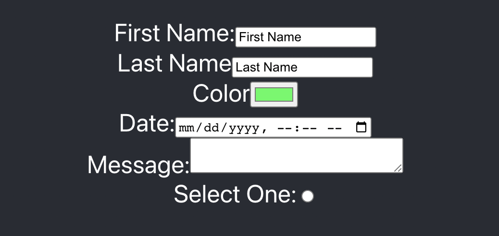

# Form practice - React.js App
+  A React app that demonstrates how to create a form with various input fields using React's useState hook. 



...
## Covered in Class
* onChange
* Form Elements
* Controlled Components
...
# Basic Code
```
<label> First Name:
<input type="text">
</label>
```